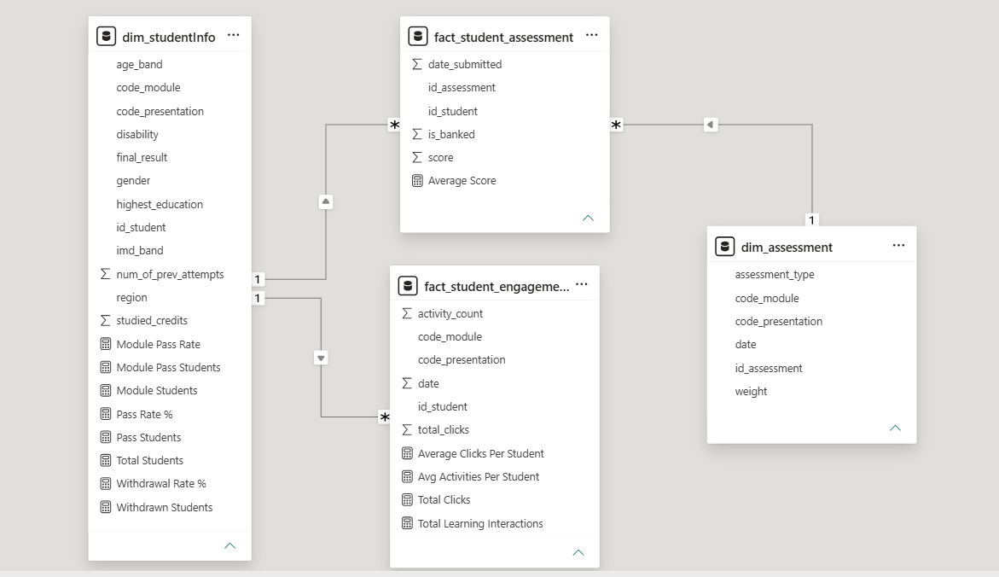

# Learning Analytics Dashboard Using OULAD

## 📌 Project Overview
This project delivers an end-to-end analytics and business intelligence solution analyzing student engagement, academic performance, and learning outcomes using the **Open University Learning Analytics Dataset (OULAD)**. 

The objective was to transform raw educational data into actionable insights that help explain student performance, engagement behavior, and academic outcomes through interactive Power BI dashboards.

### 🛠️ Tools & Skills Demonstrated
* **Languages & Libraries:** Python, Pandas
* **Data Modeling:** Dimensional Modeling, Star Schema Design
* **Business Intelligence:** Power BI, DAX (Data Analysis Expressions)
* **Version Control:** GitHub
* **Core Analytics Workflow:** Data Understanding, Quality Assessment, Advanced Data Cleaning, BI Reporting, and Dashboard Design.

---

## 📊 1. Dataset Acquisition & Exploration
The dataset was acquired from the Open University Knowledge Media Institute ([OULAD Source](https://analyse.kmi.open.ac.uk/open-dataset)). It tracks comprehensive student demographics, course registrations, assessments, academic outcomes, and Virtual Learning Environment (VLE) interaction logs.

The following raw source files were reviewed and mapped:
* **`courses.csv`**: Contains course module information, presentation periods, and total duration.
* **`assessments.csv`**: Contains assessment identifiers, type, relative weight, and scheduling.
* **`studentAssessment.csv`**: Contains individual student assessment submissions, recorded scores, and exact submission timelines.
* **`studentInfo.csv`**: Central demographic profiles including education background, region, age group, disability status, and final academic result.
* **`studentRegistration.csv`**: Tracks course registration and formal withdrawal dates.
* **`studentVle.csv`**: High-volume daily student interaction logs and specific click activity.
* **`vle.csv`**: Detailed learning resource metadata and activity categorizations.

---

## 🔍 2. Data Quality Assessment & Cleaning
A structured data quality audit was executed covering dataset shapes, data types, missing values, duplicate records, and statistical anomalies.

### Key Audit Findings:
* **`studentAssessment`**: 173,912 records | 173 missing scores | 2,057 negative submission dates (indicating early submissions).
* **`studentInfo`**: 32,593 records | 1,111 missing IMD Band values | Zero duplicate records.
* **`studentRegistration`**: 45 missing registration dates | 22,521 missing withdrawal dates.
* **`studentVle`**: **10.6 Million records** | 787,170 duplicate interaction rows | No missing values.

### Applied Data Cleaning Actions:
1. **Missing Value Treatment**: Missing assessment scores were retained and flagged to avoid distorting performance metrics. Missing IMD Band values were categorized as `Unknown`. Missing withdrawal dates were logically interpreted as active course completion.
2. **Duplicate Handling**: The 787,170 duplicate interaction records within `studentVle` were programmatically aggregated to keep precise tracking numbers intact.
3. **Standardization & Validation**: Categorical variables were standardized and verified against foundational business rules (e.g., cross-referencing identifiers and registration timelines).

---

## 📐 3. Data Modeling & Engagement Aggregation

### ⚡ Performance Optimization Challenge
The original `studentVle` table held over 10 million records, impacting Power BI desktop performance and visual refresh lag. 

To optimize performance, student interactions were aggregated up to the **Student ➡️ Module ➡️ Presentation ➡️ Date** level. Calculated metrics for `Total Clicks` and `Activity Count` were engineered. This process successfully reduced the table to **~1.8 million records**, vastly accelerating Power BI performance.

### Star Schema Architecture
Relationships were mapped using a clean star-schema framework, separating dimensions from dense transactional fact tables:

* **Dimension Tables:** `dim_studentInfo`, `dim_courses`, `dim_assessment`, `dim_student_registration`.
* **Fact Tables:** `fact_student_assessment`, `fact_student_engagement`.

---

## 🧪 4. Business Intelligence Core: DAX Measures
Key DAX measures were engineered to drive responsive visual evaluations across student dimensions and performance metrics:
* **`Average Assessment Score`** = `AVERAGE(fact_student_assessment[score])` — Evaluates ongoing academic performance.
* **`Pass Students`** = Counts unique learners achieving a final mark of 'Pass' or 'Distinction'.
* **`Total Students`** = Counts unique enrolled learners.
* **`Pass Rate %`** = `DIVIDE([Pass Students], [Total Students], 0)` — Tracks structural module success rates.
* **`Average Clicks Per Student`** & **`Average Activities Per Student`** — Evaluates granular digital VLE engagement patterns.

---

## 🎨 5. Dashboard Architecture & Analysis
The Power BI report splits the analytical depth across three business-ready reporting environments:

### Page 1: Executive Overview
* **Purpose:** Provides executive stakeholders an immediate high-level summary of total enrollment and macro learner success rates.
* **KPIs Featured:** Total Students (29K), Total Clicks (40M), Average Score (75.80), and global Pass Rate (37.63%).

### Page 2: Student Performance Analysis
* **Core Business Questions Answered:** Does prior educational background dictate scores? Which age groups or regions generate stronger outcomes? Which specific modules present high academic risk?
* **Key Finding:** Student success rates varied significantly across different course modules, highlighting potential structural optimization opportunities.

### Page 3: Engagement & Learning Behavior Analysis
* **Core Business Questions Answered:** Do highly engaged digital students achieve stronger final results? Which modules generate the highest density of online activity?
* **Key Finding:** Higher digital engagement levels (VLE interaction counts and total clicks) are strongly associated with 'Pass' and 'Distinction' outcomes.

---

## 💡 6. Key Strategic Insights

* **Academic Performance Drivers:** Post-graduate and highly qualified student segments maintained stronger baseline scores. However, high variance in pass rates across modules suggests that course configuration heavily influences student results.
* **Engagement as a Performance Proxy:** Clear, positive correlations exist between interactive activity logs and top-tier final outcomes. Students who failed or withdrew exhibited drastically lower VLE footprints.
* **Proactive Retention Opportunities:** By capturing early-stage registration paths and tracking early week-to-week VLE click drops, academic institutions can deploy intervention strategies to support at-risk students before critical assessment dates.

---

## 🚀 How to Run this Project Locally
1. Clone this repository to your local machine.
2. Download the source CSV files from the [OULAD Portal](https://analyse.kmi.open.ac.uk/open-dataset).
3. Open the Power BI report file (`.pbix`) in Power BI Desktop.
4. Update the source file parameters to target your local directory paths and click **Refresh**.
